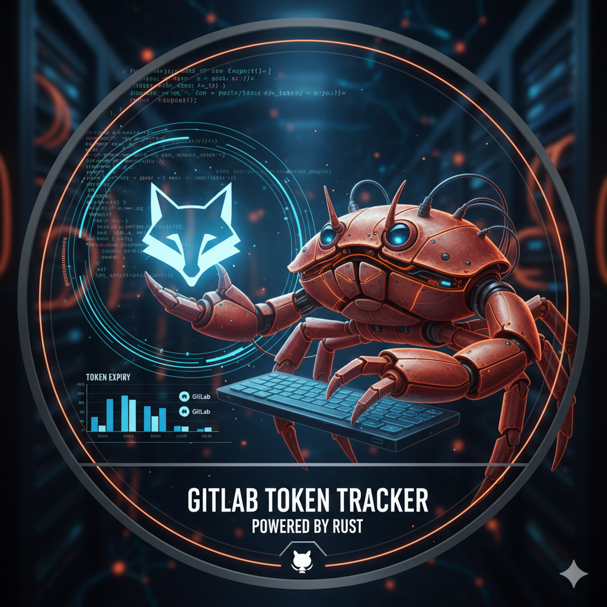

# gitlab-warden
A Rust-powered watchdog that monitors GitLab Personal and Project Access Tokens, tracks their expiration dates, and notifies you before they die via Prometheus metrics.

🛡️ GitLab Warden

GitLab Warden is a lightweight, blazing-fast Rust utility that keeps your GitLab tokens under watch.
No more “why the hell did my pipeline stop working?” mornings — Warden checks token expirations, warns you in advance, and integrates beautifully into your DevOps workflow.

🚀 Features

🔍 Fetches Personal, Project, and Group access tokens from the GitLab API

⏳ Tracks and reports days until expiration

🔔 Sends alerts via Slack, Telegram, Email, or Console logs

📊 Exposes Prometheus metrics for observability stacks (Grafana-friendly)

⚙️ Works standalone, in GitLab CI, or as a cronjob

⚡ Built in Rust — safe, fast, concurrent, and dependency-light

🧠 Use Cases

Centralized monitoring of all tokens in your org

Automated expiry alerting to Slack or Telegram

Integration with Grafana dashboards

CI/CD pipeline health assurance

🔧 Configuration

Set your environment variables in a .env file: